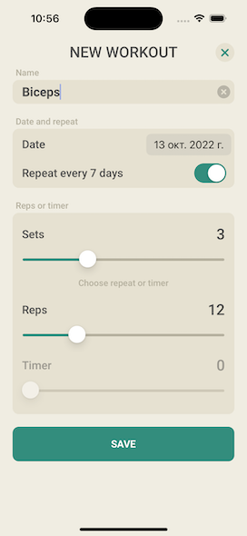
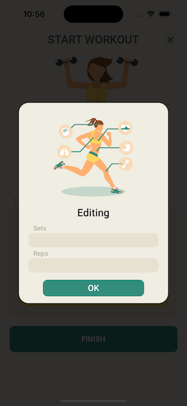

# WorkOut ✓

I try to make this application by my own using my skills

## What skills I used

* integrate third party libraries in app using Cocoapods
* create, update, save and delete data in Realm
* make queries and sort the database
* work with UITableViews and set data sources and delegates
* create custom cells
* make http requests 
* decode JSON
* all UI written programmaticaly 
* create custom alerts

# To bild:
- clone the repo
- install cocoaPods
- install Realm
- launch WorkOut.xcworkspace

