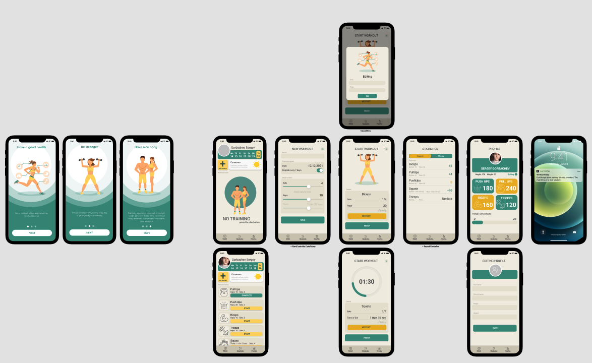
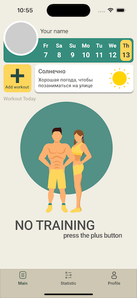

# WorkOut ✓

I try to make this application by my own using my skills

<!--## What skills I used-->

<!--* integrated third party libraries in app using Cocoapods.-->
<!--* create, update, save and delete data in Realm.-->
<!--* made queries and sort the database.-->
<!--* worked with UITableViews and how to set their data sources and delegates.-->
<!--* create custom cells-->
<!--* make http requests -->
<!--* decode JSON-->
<!--* all UI written programmaticaly -->
<!---->
<!---->
<!---->
<!--# To bild:-->
<!--- clone the repo-->
<!--- install cocoaPods-->
<!--- install Realm-->
<!--- launch WorkOut.xcworkspace-->

<!---->
<!---->
